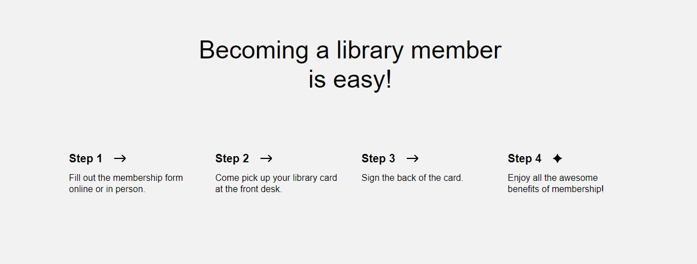
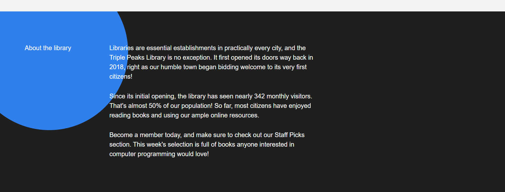

# Project 1: Triple Peaks Library

[Link to the project](https://tj-singh-portfolio.github.io/se_project_library/index.html)

## Overview

A simple project that is a mock library website. It features a few sections that use some CSS positioning techniques.

The techniques and technologies used in this project include:

- Semantic HTML5
- Flexbox
- Positioning
- Vertical stacking with z-index

## Demo Images

### Plans for Improvement

I plan to add some animations, make the website dynamic at different resolutions, and create a night theme for a less bright experience.
